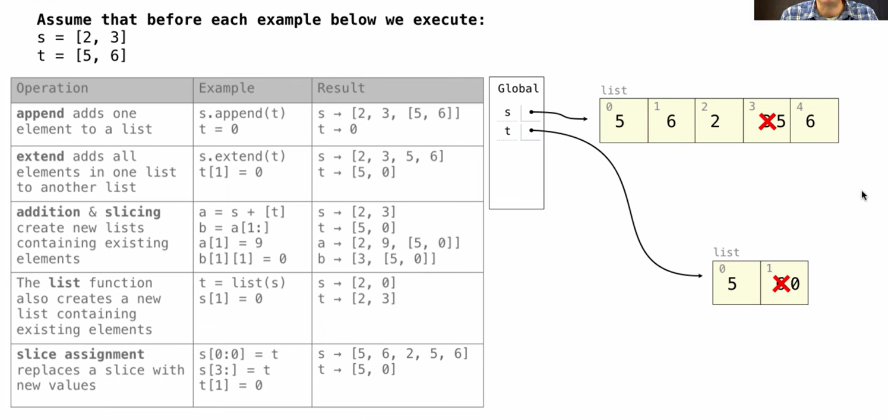
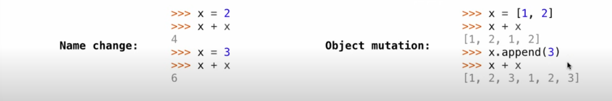
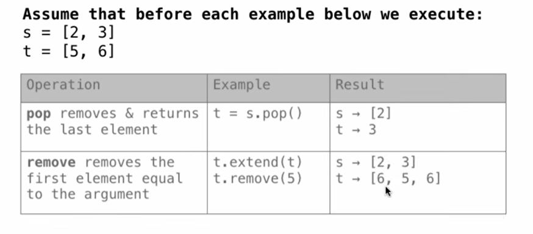

1. append(对单个值): 传的是指针(因为这里传入的单个量是t(list:可变量))，添加的部分会和t一起改变(object mutation)(图中只使用了name change)
   - The value of an expression can change because of changes in names or objects
   -  
2. extend(可以是多个值):传的是value , 与t不影响
3. addition and slicing: 传的是value(create new list),图中的情况是因为：[t]部分创建时就是一个指向t的指针
4. list(): 拷贝新的,value
5. slice assignment: value
